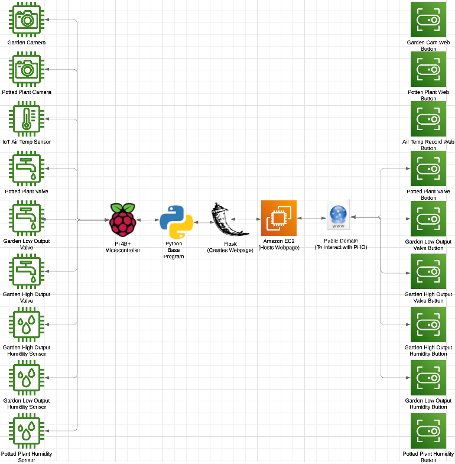
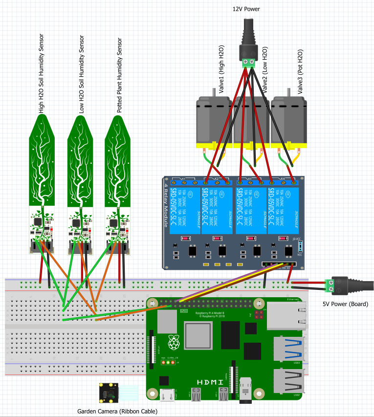

# Garden_Pi

## Goal
To create an autonomous gardening system that can self regulate, but also be controlled through a web interface by anyone with the correct credentials from anywhere in the world.

## Method
1. Write a program that takes in air temperature and soil humidity readings from sensors and waters the garden autonomously through ball valves controlled by a raspberry Pi.
2. Incorporate a livestream function into the program using a PiCamera
3. Create a Flask webpage that supports toggling various Pi IO (ball valves for watering)
4. Host the webpage on AWS EC2 instance so that the page can be accessed by those with the correct credentials from anywhere in the world

## Equipment
1. Raspberry Pi 4B+
2. Raspberry Pi Camera Module 3 (Wide Angle)
3. Adafruit STEMMA Soil Sensor - I2C Capacative Moisture Sensor
4. Automated Ball Valves by US Solid (Auto closing)

## Network Diagram

## Circuit (IO) Diagram

## General Notes
1. Each ball valve will supply a different set of water lines that support different areas of the garden: Low H2O, High H2O, and Potted Plants.
